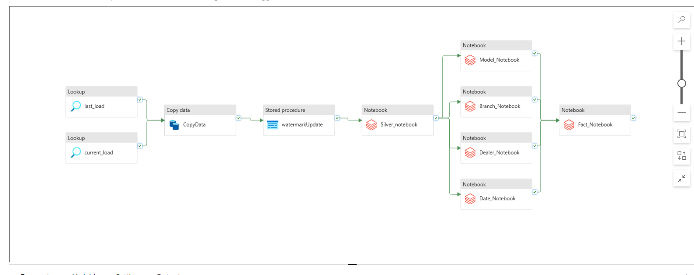
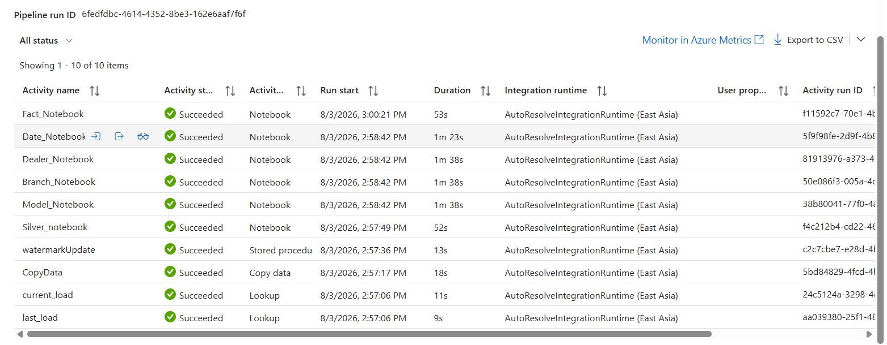
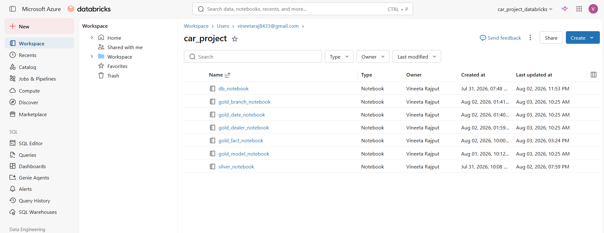
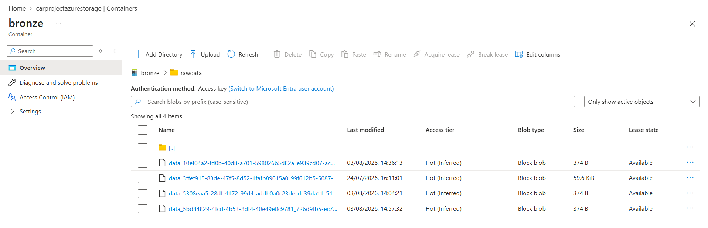
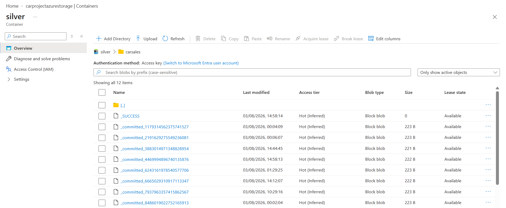
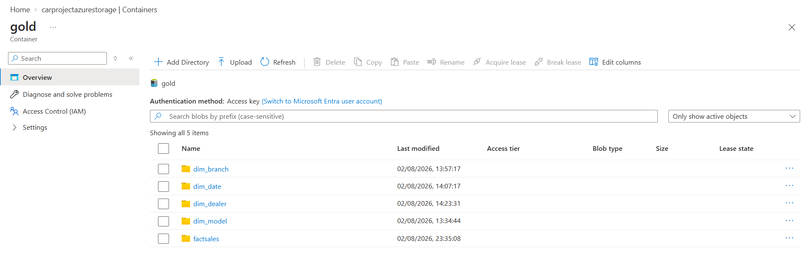
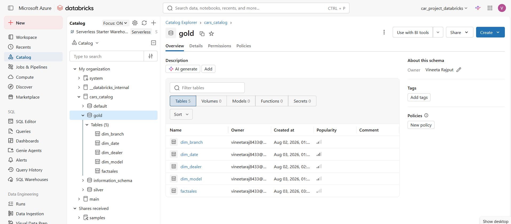
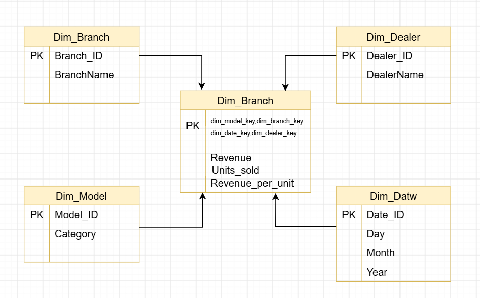

# 🚗 Car Sales Data Warehouse using Azure Data Factory & Azure Databricks

## 📌 Project Overview

This project demonstrates an end-to-end ETL pipeline built on Microsoft Azure for processing car sales data into a dimensional data warehouse.

The solution uses:

- Azure Data Factory (ADF)
- Azure Databricks
- Unity Catalog
- Delta Lake
- GitHub Version Control

The pipeline ingests raw data, transforms it into Bronze, Silver, and Gold layers, creates dimension and fact tables, and orchestrates the entire workflow using Azure Data Factory.

---

# 🏗️ Architecture


---

# 📂 Repository Structure

```text
.
├── Databricks_notebook/
│   ├── Bronze_Notebook
│   ├── Silver_Notebook
│   ├── Gold_Dimension_Notebook
│   ├── Gold_Fact_Notebook
│   └── Incremental_Load_Notebook
│
├── data/
│   └── Raw CSV Files
│
├── dataset/
│   └── ADF Dataset Definitions
│
├── factory/
│   └── Azure Data Factory Configuration
│
├── linkedService/
│   └── Linked Service Definitions
│
├── pipeline/
│   └── ADF Pipeline JSON
│
├── workflow/
│   └── Workflow Configuration
│
├── star_schema/
│   └── Star Schema Diagram
│
├── README.md
└── publish_config.json
```


---

# 🛠️ Technologies Used

| Service | Purpose |
|----------|----------|
| Azure Data Factory | Pipeline orchestration |
| Azure Databricks | Data Processing |
| Delta Lake | Storage Format |
| Unity Catalog | Data Governance |
| GitHub | Version Control |
| PySpark | Data Transformation |
| SQL | Data Validation |

---

# 📁 Data Flow

```
Raw Files
     │
     ▼
 Bronze Layer
     │
     ▼
 Silver Layer
     │
     ▼
 Gold Layer
     │
     ▼
Dimension Tables
Fact Table
```

---

# 📊 Pipeline Workflow

1. Load Raw CSV Files
2. Create Bronze Tables
3. Clean & Transform Data
4. Create Silver Tables
5. Generate Dimension Tables
6. Generate Fact Table
7. Execute Incremental Load
8. Orchestrate using Azure Data Factory

---

## Azure Data Factory Pipeline



---

## Pipeline Success Run



---

## Databricks Workspace



---

## Bronze Layer



---

## Silver Layer



---

## Gold Layer



---

## Dimension Table and Fact Table



---

# 📈 Data Model



---

# 🚀 Pipeline Execution

The Azure Data Factory pipeline executes the notebooks in the following order:

```
Bronze Notebook
      │
      ▼
Silver Notebook
      │
      ▼
Dimension Notebook
      │
      ▼
Fact Notebook
      │
      ▼
Incremental Load
```

---

# 🔄 Incremental Loading

The project supports incremental data loading using:

- Watermark strategy
- Delta Lake MERGE
- Upsert operations
- Duplicate prevention

---

# ✅ Features

- End-to-End ETL Pipeline
- Medallion Architecture
- Delta Lake
- Incremental Loading
- Star Schema
- Azure Data Factory Orchestration
- GitHub Integration
- PySpark Transformations
- Unity Catalog Support

---

# 📌 Future Enhancements

- Power BI Dashboard
- Data Quality Checks
- CI/CD Deployment
- Monitoring & Alerts
- Automated Testing

---


# ⭐ If you like this project

Give the repository a ⭐ on GitHub.
